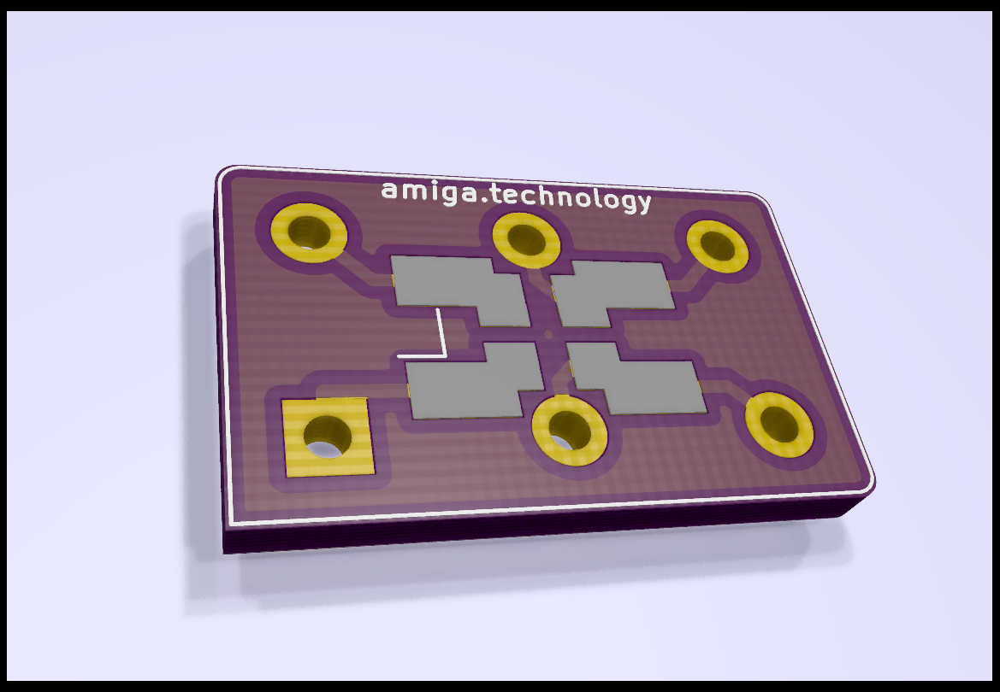

# novOSC - Oscillator adapter

This project lets you use SMD ocillators on old iron like Amiga computers.

Check out [the Amiga Technology blog](https://amiga.technology/2020/08/31/rock-around-the-clock/) for more information.

You can order this project [on PCBWay](https://www.pcbway.com/project/shareproject/novOSC___new_oscillators_in_old_iron.html) or [on OSHPARK](https://oshpark.com/shared_projects/E401Ahjg)

